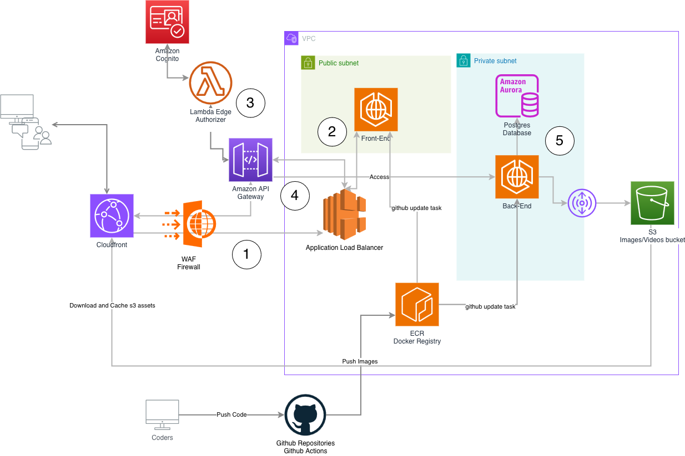

# Platform

## Commands

* `npm run build`   compile typescript to js
* `npm run watch`   watch for changes and compile
* `npm run test`    perform the jest unit tests
* `npx cdk deploy`  deploy this stack to your default AWS account/region
* `npx cdk diff`    compare deployed stack with current state
* `npx cdk synth`   emits the synthesized CloudFormation template

## Code pipeline flow

### Environments

- Preview
- Dev
- Production

→ dedicated vpc with front/server/s3/database

### Code pipeline

- PR: Each time a new PR is created for backend and frontend in Preview Env
- Dev Main Branch: Each time a new PR is being merged, the docker image build and push is executed on the ECR with `latest` tag. Dev Env is reloaded with this new image.
- Production Release: Each time we want to promote in production a github action release on demand needs to be run manually with admin approval to build/push the docker image and reload Production Env.